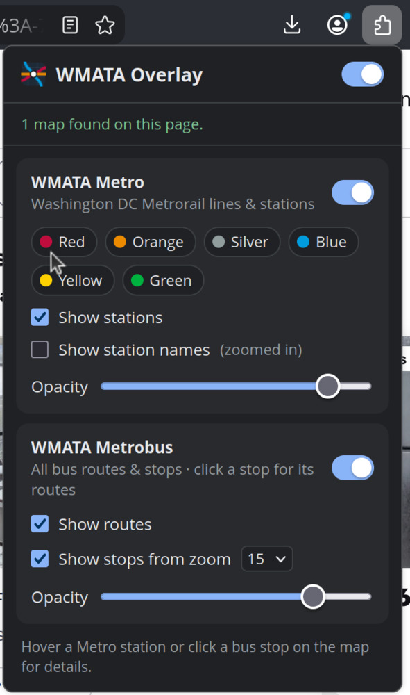
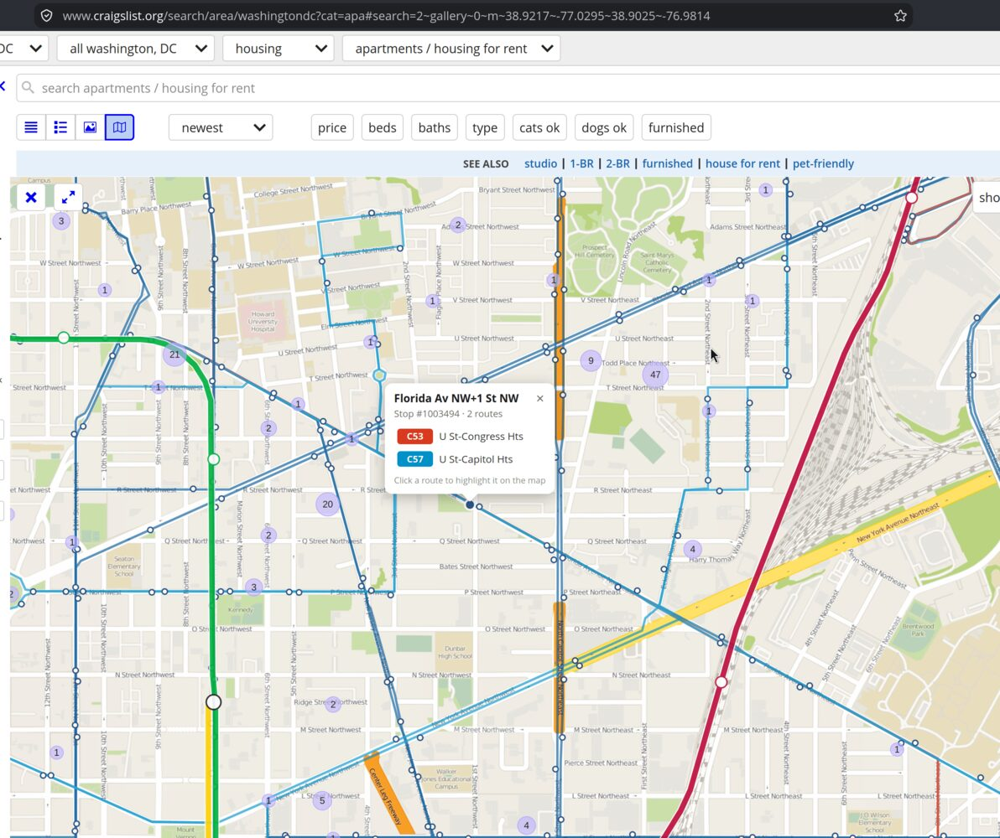
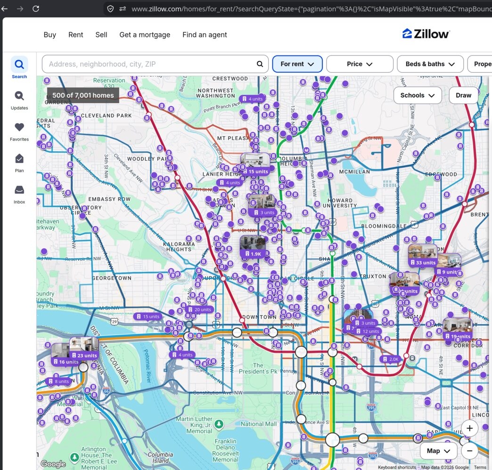

# WMATA overlay for map widgets

Browser extension (Chrome, Firefox) that detects Google Maps JS API maps and Leaflet (OpenStreetMap) maps on any website, and google.com/maps itself, and draws overlays on them:

- **Metro**: all six lines in WMATA colors, shared track side by side, all stations. Hover a station for its lines.
- **Metrobus** (off by default): all routes, colored by service tier. Stops appear from a configurable zoom level (default 15). Click a stop to list its routes; click a route to highlight it.

Toggle overlays, lines, and options from the toolbar popup. `Alt+Shift+M` toggles everything.

Leaflet maps are supported when the page exposes Leaflet as `window.L` (e.g. Craigslist's map view). Does not work with Mapbox GL / MapLibre maps or `google.com/maps/embed` iframes.

## Local setup

Chrome:
1. `chrome://extensions` → enable Developer mode → Load unpacked → `extension/`.

Firefox (142+):
1. `about:debugging#/runtime/this-firefox` → Load Temporary Add-on → `extension/manifest.json`.

Or run `./launch-chrome.sh` (Chrome for Testing, profile in `./chrome/`) or `./launch-firefox.sh` (web-ext, profile in `./firefox/`).

## Publishing

`./package-chrome.sh` builds `dist/wmata-overlay-chrome-<version>.zip` for the Chrome Web Store; `./package-firefox.sh` builds `dist/wmata-overlay-firefox-<version>.zip` for addons.mozilla.org (and runs `web-ext lint`). Bump `version` in `extension/manifest.json` before each upload.

## Data

Bundled in `extension/data/`; the extension makes no network requests.

| File | Source | Rebuild |
|---|---|---|
| `wmata.json` | DC Open Data (DC GIS) Metro Lines/Stations Regional layers | `node tools/build-wmata-data.mjs` |
| `bus.json` | WMATA Metrobus GTFS, via the Mobility Database mirror (feed mdb-1846) | `node tools/build-bus-data.mjs` (needs `unzip`) |

The data only changes when you rebuild it: run the script, then reload the extension. The current bus feed is valid through 2027-03-27.
